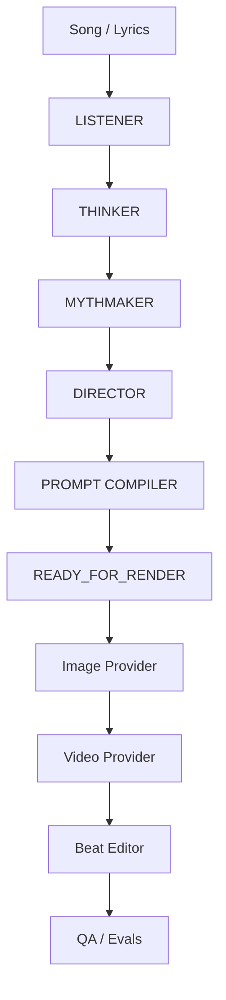

# Architecture

## Cognitive graph

## Contracts

The JSON artifacts are the canonical boundary between reasoning and rendering.

That allows:
- replacing the reasoning model,
- adding local models,
- rerunning only one stage,
- comparing alternate stories,
- evaluating continuity,
- using different image/video vendors,
- preserving an audit trail.

## Agent responsibilities

### LISTENER
Observes. It does not philosophize heavily.

### THINKER
Interprets. It creates the semantic/philosophical lattice.

### MYTHMAKER
Explores three mutually distinct stories.

### DIRECTOR
Commits to one film language and a scene timeline.

### PROMPT COMPILER
Converts direction into renderer-specific instructions without changing the story.

## Approval boundary

Cognitive generation writes local JSON.

Image generation is a separate explicit command.

Video generation is provider-neutral in v0.1 and only exports jobs.

External publishing is out of scope.
